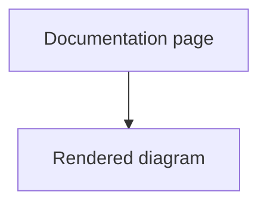

# Documentation renderer smoke test

This unindexed fixture provides a small Mermaid diagram for checking that the static documentation renderer can display a diagram. It is not a graph node.

```mermaid
flowchart TD
  A[Documentation page] --> B[Rendered diagram]
```
